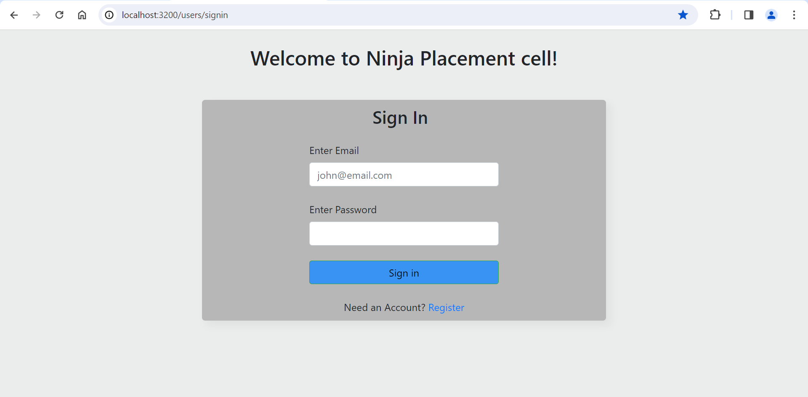
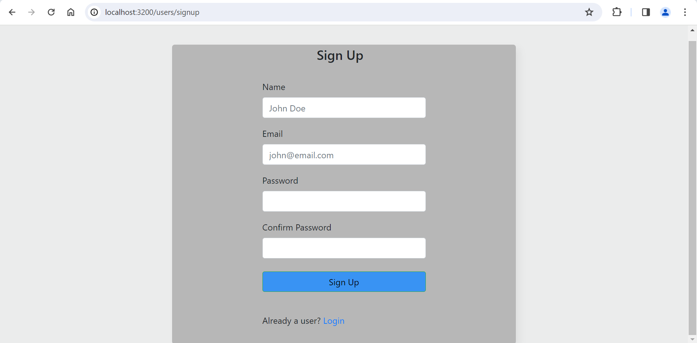
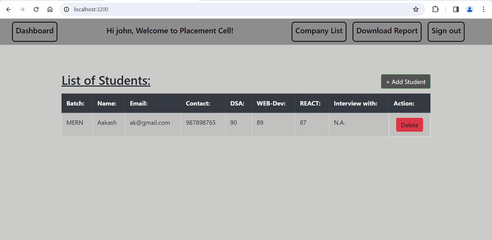
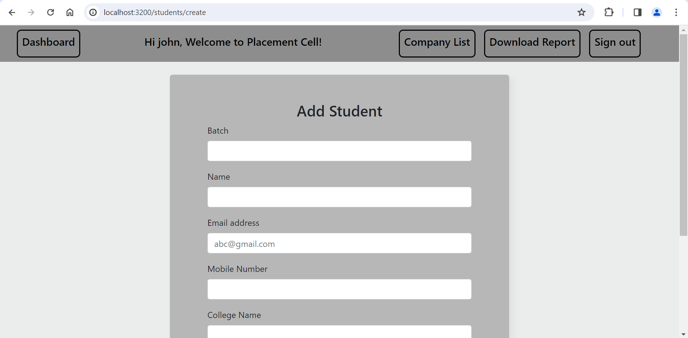
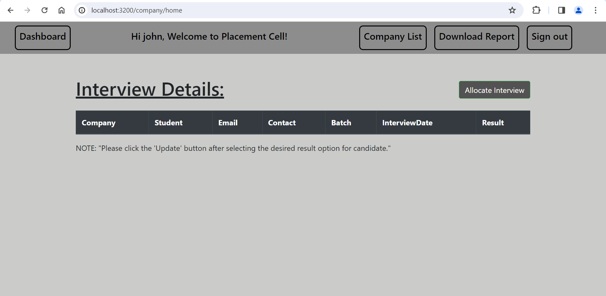
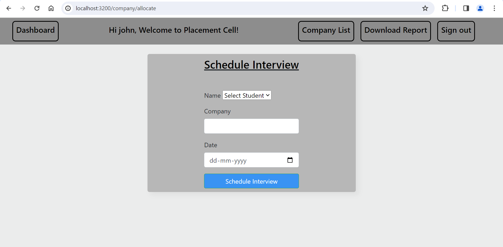

# Placement_Cell_APP
This placement cell web application is created for users/employees to manage interviews of students, and allocate students to companies interviews.
It is built using NodeJs, ExpressJs, MongoDB, EJS and JavaScript.

## ⚙️ Functionality
- User/Employee singUp and signIn
- Add student
- Delete student
- Allocate added student to the interview
- Edit interview result status
- Download the CSV report

## 🧑‍💻 Getting started
- Fork the project
- Clone the forked repository in your local system
- Create .env file in the root director and add the following:-
  - PORT = "Your port number"
  - MONGODB_URL = "Your MongoDB URL"
  - SESSION_SECRET_KEY = "Your secret session key"
- Install all required packages
- Run project
   ` npm install ` 
- The project is running on the port number provided by you.
   ` npm start `

## 🛠️ Tools Used
- NodeJS
- MongoDB
- EJS

### 📚 Libraries:
- bcrypt
- body-parser
- cookie-parser
- dotenv
- ejs
- express
- express-session
- fast-csv
- fs
- mongodb
- mongoose
- multer
- nodemon
- passport
- passport-local

## 🖼️ Screenshorts

